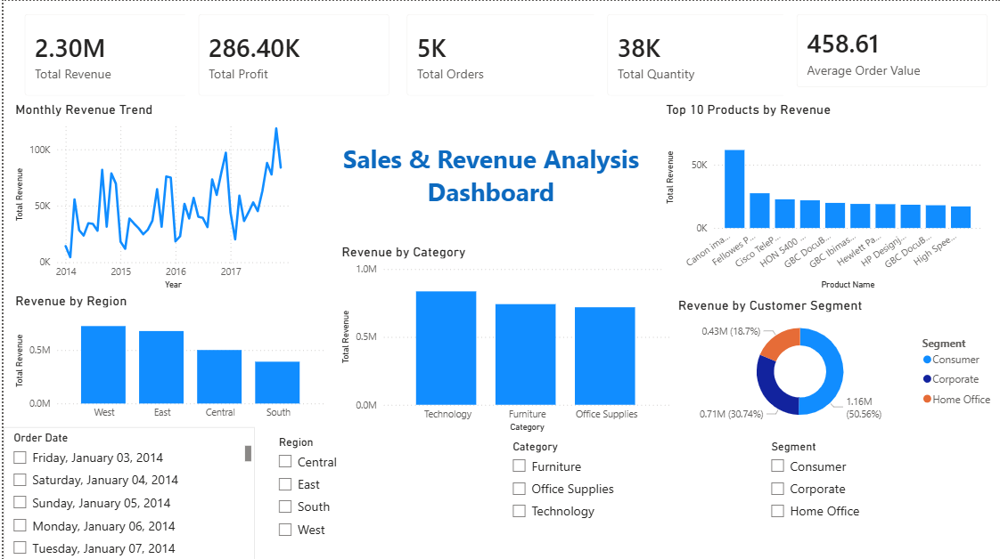

# Sales & Revenue Analysis Dashboard

## Project Overview

This project is a Power BI dashboard created to analyze sales and revenue data and generate meaningful business insights.

## Dashboard Features

- Total Revenue
- Total Profit
- Total Orders
- Total Quantity
- Average Order Value
- Monthly Revenue Trend
- Top 10 Products by Revenue
- Revenue by Category
- Revenue by Region
- Revenue by Customer Segment
- Interactive filters for Order Date, Region, Category, and Segment

## Tools Used

- Power BI
- Microsoft Excel / CSV Dataset
- DAX
- Data Visualization

## Dashboard Preview

## Business Insights

- Technology generates the highest revenue among the product categories.
- The West region contributes the highest revenue.
- Consumer customers contribute the largest share of revenue.
- Revenue trends vary across months, helping identify stronger and weaker sales periods.
- The Top 10 Products analysis highlights the products contributing most to overall revenue.
- The dashboard helps track revenue, profit, orders, and quantity through interactive filters.
